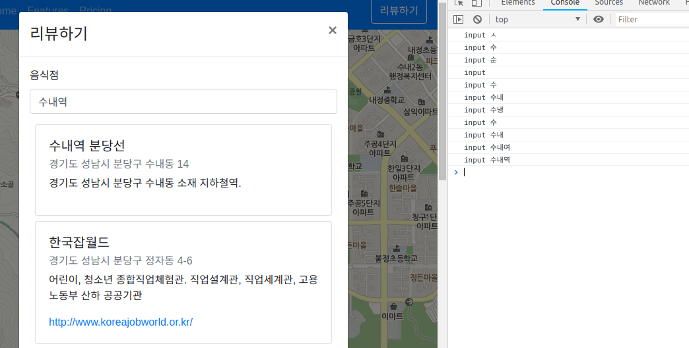
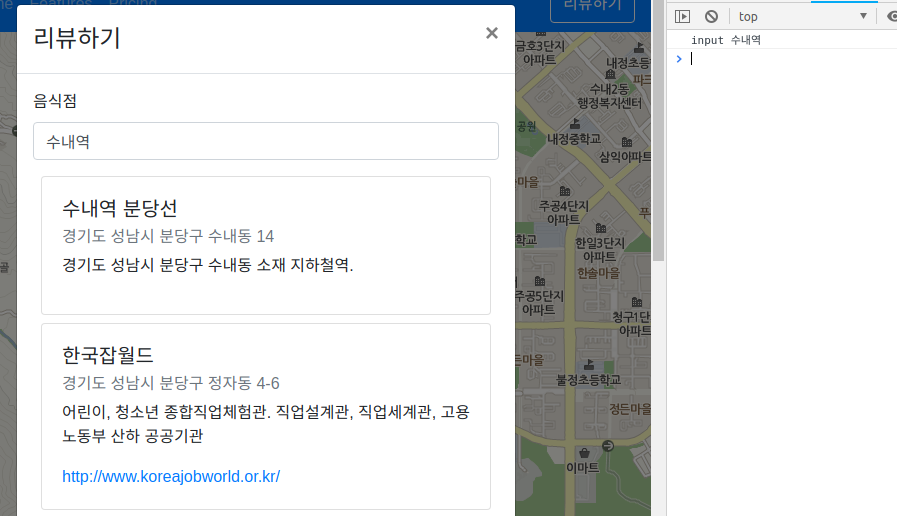

# throttling(쓰로틀링)과 debouncing(디바운싱)

## throttling(쓰로틀링)이란?

쓰로틀링은 마지막 함수가 호출된 후 일정시간이 지나기 전에 다시 호출되지 않도록 하는 것

## throttling이 필요한 이유

- scroll 이벤트가 발생할 때 복잡한 작업이 일어나도록 한다면 매우 빈번하게 실행되므로 성능에 영향을 미쳐 렉이 걸릴 수도 있다. 그러므로 일정 시간이 지나기 전에 다시 호출되지 않도록 제한을 거는 것이다.

## debouncing(디바운싱)이란?

Debouncing: To limit a function to be called only once in a period of time.

디바운싱은 일정 시간동안에 함수가 한 번만 호출되도록 제한하는 것(제일 처음 또는 마지막)

## debouncing이 필요한 이유

- 불필요한 요청을 연이어 하면 브라우저의 성능에 영향을 미친다. (javascript는 single threaded language라는 것을 기억하자.)
- 불필요한 요청을 보내는 것 역시 낭비지만 유료 API 요청이라면 경제적인 비용도 낭비다.
- 화면 역시 다시 렌더링되어야 한다.

예) API 요청을 하는 경우



디바운싱 처리를 해주지 않으면 'ㅅ', '수' 와 같이 검색결과가 없을 것 같은 내용 즉 사용자의 의도에 맞지 않은 내용에 대해서도 요청을 하게 된다.

반면 아래와 같이 디바운싱 처리를 해주면 의도대로 처리되는 것을 알 수 있다.



## 리액트에서 디바운싱 구현하기

입력 폼에 사용자 입력이 들어왔을 때 입력 데이터에 따른 검색 결과를 ajax 요청하는 상황을 구현해보았다. 디바운싱이 더욱 적절하므로 디바운싱으로 구현했다. (쓰로틀링과 디바운싱이 헷갈릴 수 있는데 쓰로틀링은 일정시간에 한 번은 반드시 실행되도록 하지만 디바운싱은 입력 데이터가 들어오면 제한이(타이머가) 갱신되는 방식이다. 아래 코드를 참고하면 이해에 도움이 된다.)

1. 직접 구현하는 방법

```js
handleChange = event => {
  this.setState(
    {
      restaurantTitle: event.target.value
    },
    () => {
      if (this.timer) {
        clearTimeout(this.timer);
      }
      this.timer = setTimeout(() => {
        this.handlePreview(); // ajax request
      }, 200);
    }
  );
};
```

예외와 상관이 그냥 구현한다면 디바운싱은 위와 같이 구현할 수 있다.

2. lodash 라이브러리를 사용하는 방법

```js
import { debounce  } from 'lodash';

constructor(props) {
    super(props)
    this.state = {
        /* ... */
    }
    this.handlePreviewDebounced = debounce(this.handlePreview, 200);
}


handleChange = (event) => {
    this.setState({
        restaurantTitle: event.target.value,
    }, () => {
        this.handlePreviewDebounced();
    })
}
```

위와 같이 작성하면 간단하게 lodash 라이브러리를 활용해서 debounce를 구현할 수 있다. react의 SyntheticEvent와 간단해서 생기는 문제점은 SyntheticEvent에 대해 작성하면서 살펴보겠다.

(throttle-debounce 라이브러리를 사용하여 구현하는 방법도 있다.)

참고)

쓰로틀링과 디바운싱 - Zerocho 블로그
[throttling and debouncing](https://www.zerocho.com/category/JavaScript/post/59a8e9cb15ac0000182794fa)

using debounce in react components - Revath S Kumar 블로그
[using debounce in react components](https://blog.revathskumar.com/2016/02/reactjs-using-debounce-in-react-components.html)

How to throttle and debounce an autocomplete input in react - Peterbe.com
[autocomplete input in react](https://www.peterbe.com/plog/how-to-throttle-and-debounce-an-autocomplete-input-in-react)
