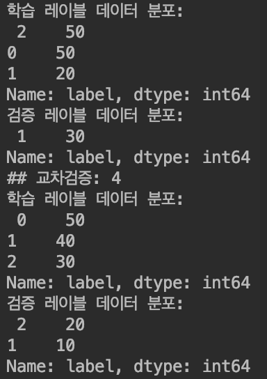

머신러닝 모델의 적합성 평가에 대한 내용을 학습하며 생긴 궁금증들을 정리해봤습니다.

# 검증 데이터셋(Validation Set)과 테스트 데이터셋(Test Set)의 차이는?

머신러닝 모델을 구현하면 해당 모델의 성능이 어떠한지 평가하는 과정을 거치게 됩니다. 이 때 보유하고 있는 데이터셋을 분할합니다. 일반적으로 학습 데이터, 검증 데이터, 테스트 데이터로 나눕니다. 아래는 각 데이터에 대한 간단한 설명입니다.

학습 데이터(Training Set)

- 학습 데이터는 머신러닝 알고리즘의 학습을 위해 사용되는 데이터로, 데이터들의 속성들과 결정값(레이블) 값을 모두 가지고 있음
- 학습 데이터를 기반으로 머신러닝 알고리즘이 데이터 속성과 결정값의 패턴을 인지하고 학습

검증 데이터(Validation Set)

- 추정한 모델이 적합한지 검증하기 위한 데이터

테스트 데이터(Test Set)

- 학습된 머신러닝 알고리즘을 테스트하기 위해 사용되는 데이터로, 속성 데이터만을 머신러닝 알고리즘에 제공함
- 머신 러닝 알고리즘은 제공된 데이터를 기반으로 결정값을 예측함
- 테스트 데이터는 학습 데이터로 별도의 데이터 세트로 제공되어야 함

Q. 테스트 데이터가 있는데 굳이 검증 데이터이 있는 이유는 무엇일까? 둘의 차이는 무엇일까?

저의 의문은 "테스트 데이터도 성능을 평가하기 위한 것이고, 검증 데이터도 성능을 평가하기 위한 것이면 굳이 검증 데이터가 있는 이유는 무엇일까?"였습니다. "어차피 테스트 데이터셋에서 결판나는 것이 아닌가?"라는 생각이 들었습니다.

이에 대한 답은 모델의 학습에 관여하는가? 관여하지 않는가?가 그 차이라는 것입니다. 테스트 데이터는 모델의 최종 성능을 평가하기 위한 데이터입니다. 그러므로 철저히 미지의(unseen) 데이터이어야 합니다. 그래서 모델의 학습에는 절대 사용해서는 안됩니다. 문제는 학습을 열심히 했는데 테스트 데이터로 테스트해보니 성능이 엉망이면 어떻게 하냐?라는 것입니다. 그래서 있는 것이 검증 데이터셋입니다.

모델의 학습을 수행하기 전에 사전에 설정해야 하는 값을 '하이퍼파라미터(Hyperparameter)'라고 합니다. 이 하이퍼파라미터에 따라 모델의 성능을 좌우되기도 합니다. 검증 데이터가 있으면 테스트 데이터로 최종 성능을 평가하기 전에 하이퍼파라미터를 조정해나갈 수 있습니다. 이를 통해 오버피팅(Overfitting)과 같은 문제의 가능성을 낮출 수 있습니다. (오버피팅은 간단히 말하면 모델이 학습 데이터에 너무 잘 맞지만, 테스트 데이터에는 잘 맞지 않아 성능이 떨어지는 문제를 말합니다.)

하이퍼파라미터의 조정을 굳이 하지 않겠다면 검증 데이터셋은 필요하지 않습니다. 학습 데이터셋과 테스트셋으로만 나누어도 됩니다. 하지만 검증 데이터셋이 있으면 테스트 전 하이퍼파라미터를 조정함으로써 모델을 개선할 수 있습니다.

참고) 트레이닝과 테스트 데이터로 나눌 때는 대개 8:2 또는 7:3으로 나누고, 검증 데이터셋까지 포함하면 4:3:3 또는 5:3:2로 주로 나눈다고 합니다. 중요한 것은 테스트 데이터는 새롭게 예측하게 될 미지의 데이터를 잘 대표해야 하고, 검증 데이터는 테스트 데이터를 잘 대표할 수 있어야 한다는 것입니다. (물론 트레이닝 데이터 역시 대표성 있는 데이터일 때 효과적인 학습이 일어날 것입니다.)

참고링크)

Training / Test / Validation Set: 오버피팅을 피하는 방법
[Training / Test / Validation Set: 오버피팅을 피하는 방법](https://www.youtube.com/watch?reload=9&v=GtLe9Z2No28)

Machine Learning에서 validation set을 사용하는 이유
[Machine Learning에서 validation set을 사용하는 이유](https://3months.tistory.com/118)

Model Selection and training/validation/test sets
[Lecture 0603 Model selection and training/validation/test sets](https://www.youtube.com/watch?v=MyBSkmUeIEs)

# 교차검증을 하는 이유는?

교차검증이란 학습 데이터 중 검증 데이터를 고정하지 않고 일부분을 바꾸어가며 검증 데이터로 활용하는 것을 말합니다. 왜 굳이 이렇게 할까? 라는 생각이 들면서도 짐작되었던 부분은 교차검증을 하면 특정 학습 데이터만을 사용하면서 생기는 문제점을 보완할 수 있겠다는 것입니다.

교차검증에 대한 내용은 아래의 영상에서 잘 설명하고 있습니다.

Machine Learning Fundamentals: Cross Validation
[Machine Learning Fundamentals: Cross Validation](https://www.youtube.com/watch?v=fSytzGwwBVw&t=87s)

아래의 링크에서는 교차검증을 사용하는 이유에 대해 잘 설명하고 있습니다.(아래 포스트의 경우 4부터가 교차검증에 대한 내용입니다.)

데이터셋 이야기
[데이터셋 이야기](https://tykimos.github.io/2017/03/25/Dataset_and_Fit_Talk/)

데이터가 충분히 커서 검증 데이터를 충분히 확보할 수 있다면 괜찮지만 그렇지 않은 경우라면 거의 필수인 방법이라고 합니다.

# 교차검증을 했는데 오히려 성능이 떨어졌다면?

파이썬 머신러닝 라이브러리로 유명한 사이킷런을 활용하여 간단한 실습을 진행했습니다. 내장 예제 데이터셋인 붓꽃 품종 데이터셋으로 붓꽃의 품종을 예측하는 모델을 작성하는 예제입니다. 그런데 문제점은 K-Fold 교차검증을 사용했을 때 성능이 오히려 떨어졌다는 것입니다.

```python
from sklearn.datasets import load_iris
from sklearn.tree import DecisionTreeClassifier
from sklearn.model_selection import train_test_split
from sklearn.metrics import accuracy_score
import pandas as pd


# 데이터셋 불러오기
iris_dataset = load_iris()
iris_training_data = iris_dataset.data
iris_label = iris_dataset.target

iris_df = pd.DataFrame(data=iris_training_data, columns=iris_dataset.feature_names)
iris_df['label'] = iris_label

# 학습 데이터와 테스트 데이터를 분리하기
train_feature, test_feature, train_label, test_label = train_test_split(
    iris_training_data, iris_label, test_size=0.2, random_state=156)

# decision tree 알고리즘으로 모델을 학습하고 학습된 모델로 예측하기
decision_tree_classifier = DecisionTreeClassifier(random_state=156)
decision_tree_classifier.fit(train_feature, train_label)
prediction = decision_tree_classifier.predict(test_feature)
print('예측 정확도: {0:.4f}'.format(accuracy_score(test_label, prediction)))
```

위 코드를 실행 시 아래의 결과를 반환합니다. 사이킷런에서 제공하는 train_test_split이라는 기본 내장 함수를 이용하여 데이터를 분리했습니다.

```
예측 정확도: 0.9667
```

아래의 코드는 K-Fold 교차검증을 이용한 경우입니다.

```python
from sklearn.datasets import load_iris
from sklearn.tree import DecisionTreeClassifier
from sklearn.metrics import accuracy_score
from sklearn.model_selection import KFold
import numpy as np


iris_dataset = load_iris()
iris_training_data = iris_dataset.data
iris_label = iris_dataset.target

decision_tree_classifier = DecisionTreeClassifier(random_state=156)

kfold = KFold(n_splits=5)
cv_accuracy = []

n = 0
for train_index, test_index in kfold.split(iris_training_data):
    train_feature, test_feature = iris_training_data[train_index], iris_training_data[test_index]
    train_label, test_label = iris_label[train_index], iris_label[test_index]

    decision_tree_classifier.fit(train_feature, train_label)
    prediction = decision_tree_classifier.predict(test_feature)
    n += 1

    accuracy = np.round(accuracy_score(test_label, prediction), 4)
    train_size = train_feature.shape[0]
    test_size = train_label.shape[0]
    print('\n#{0} 교차 검증 정확도 : {1}, 학습 데이터 크기 : {2}, 검증 데이터 크기 : {3}'.format(n, accuracy, train_size, test_size))
    print('#{0} 검증 세트 인덱스: {1}'.format(n, test_index))
    cv_accuracy.append(accuracy)
print('\n## 평균 검증 정확도:', np.mean(cv_accuracy))
```

코드를 실행시 결과는 다음과 같습니다.

```
## 평균 검증 정확도: 0.9
```

정확도는 오히려 떨어졌습니다. 이유는 다음의 코드를 실행해보면 파악할 수 있습니다.

```python
from sklearn.datasets import load_iris
from sklearn.model_selection import KFold
import pandas as pd


iris_dataset = load_iris()
iris_df = pd.DataFrame(iris_dataset.data, columns=iris_dataset.feature_names)
iris_df['label'] = iris_dataset.target

print(iris_df['label'].value_counts())

kfold = KFold(n_splits=5)
n = 0
for train_index, test_index in kfold.split(iris_df):
    n += 1
    train_label = iris_df['label'].iloc[train_index]
    test_label = iris_df['label'].iloc[test_index]
    print('## 교차검증: {0}'.format(n))
    print('학습 레이블 데이터 분포: \n', train_label.value_counts())
    print('검증 레이블 데이터 분포: \n', test_label.value_counts())
```

아래는 코드의 실행결과입니다. 0, 1, 2는 붓꽃의 각 품종을 말합니다.



위의 실행결과 화면을 확인하면 블록 내 학습 데이터의 레이블의 분포가 균일하지 않다는 것을 알 수 있습니다. 극단적인 경우 특정 label은 전혀 포함되지 않아 해당 label에 대해서는 학습이 불가능할 수 있습니다.

이러한 문제를 해결하기 위해 사용하는 것이 Stratified K-Fold 교차검증입니다. label의 분포가 균일하지 않을 때 이를 조정해주는 방법입니다.

```python
from sklearn.datasets import load_iris
from sklearn.tree import DecisionTreeClassifier
from sklearn.metrics import accuracy_score
from sklearn.model_selection import StratifiedKFold
import pandas as pd
import numpy as np


iris_dataset = load_iris()
iris_training_data = iris_dataset.data
iris_label = iris_dataset.target
iris_df = pd.DataFrame(iris_dataset.data, columns=iris_dataset.feature_names)
iris_df['label'] = iris_dataset.target

decision_tree_classifier = DecisionTreeClassifier(random_state=156)

skfold = StratifiedKFold(n_splits=3)
n = 0
cv_accuracy = []

for train_index, test_index in skfold.split(iris_training_data, iris_label):
    train_feature, test_feature = iris_training_data[train_index], iris_training_data[test_index]
    train_label, test_label = iris_label[train_index], iris_label[test_index]

    decision_tree_classifier.fit(train_feature, train_label)
    prediction = decision_tree_classifier.predict(test_feature)
    n += 1

    accuracy = np.round(accuracy_score(test_label, prediction), 4)
    train_size = train_feature.shape[0]
    test_size = train_label.shape[0]
    print('\n#{0} 교차 검증 정확도 : {1}, 학습 데이터 크기 : {2}, 검증 데이터 크기 : {3}'.format(n, accuracy, train_size, test_size))
    print('#{0} 검증 세트 인덱스: {1}'.format(n, test_index))
    cv_accuracy.append(accuracy)
print('\n## 평균 검증 정확도:', np.mean(cv_accuracy))
```

위 코드를 실행 시 아래와 같은 실행결과를 얻을 수 있습니다. 정확도가 기존처럼 떨어지지 않는 것을 확인할 수 있습니다.

```
## 평균 검증 정확도: 0.9604
```

나누어준 데이터 블록마다의 클래스 비율이 균일하지 않을 때 모델의 성능이 오히려 하락하는 문제가 생겼습니다. 하지만 데이터셋 내 클래스별 데이터 수의 차이로 문제가 생기는 경우도 있습니다. 예를 들면 신용카드 사기 건수 검출이나 공정에서의 정상/불량 판정입니다. 데이터 발생 수를 비교하면 정상적인 케이스가 압도적으로 많으므로 오히려 비정상적인 케이스에 대해 학습을 잘 하지 못하는 경우가 발생합니다. 이러한 경우에 대한 해결책은 학습 후 다른 글에서 정리하도록 하겠습니다.
